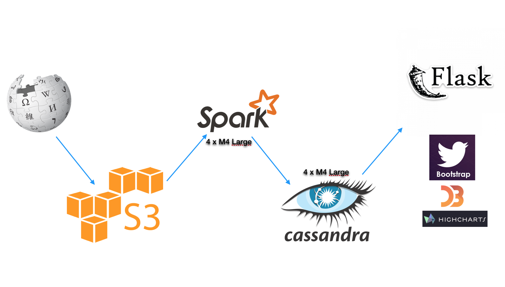

# WikiView

  <a href="https://youtu.be/qXxkRrFq3og" target="_blank">Demo Video</a>    
  <a href="http://goo.gl/KaQcIy" target="_blank">Presentation Slides</a>  

---

## Table of Contents

1. [Introduction] (README.md#introduction)
2. [Data Flow] (README.md#data-flow)
3. [AWS Cluster] (README.md#aws-cluster)
4. [Batch Processing] (README.md#batch-processing)
5. [Cassandra] (README.md#cassandra)
6. [Flask] (README.md#flask)
7. [Directory structure] (README.md#directory-structure)

## Introduction
Wikiview is a data platform where users can ask questions about individual wiki pages. It is designed for data analysts and data scientists who might want to build data models to extract meaningful information from wiki data. I am interested in asking how pageviews for a given wiki page evolves over time, how events trigger pageviews to other pages, or if one can predict which hyperlinks are visitors to a given page likely to click next.

Even though I am using this platform to crunch wiki data, this framework can also be used for other graph-related problems. One could look at citations of papers in `arxiv`, for example, or user relationships in social sites where there is a temporal component to connectedness among the nodes. Furthermore, instead of `pageview counts` metadata, one can investigate the evolution of `text` content with minor edits to the code.

---

## Data Flow
[Back to Table of Contents] (README.md#table-of-contents)

### Data

[Back to Table of Contents] (README.md#table-of-contents)

A graph related problem requires two components. First is the graph itself, which has nodes and edges. To generate this graph, I downloaded the `pages.sql.gz` and `pagelinks.sql.gz` dump that wiki media provides [Sample](https://dumps.wikimedia.org/enwiki/20170101/) . This data gives a snapshot of wiki pages and their connection to other pages. Compressed `pagelinks` and `pages` sql dump are of 5GB and 1.5GB in size respectively, which provides a challenge if you plan to merge these tables over your SQL server (don't do it).

Secondly, we need metadata that we are interested in analyzing. Wiki media also provides `pageviews` dataset that tells us the count of landings on each wiki page for every hour of the day (data is available for 2015+), which is amazing. To save space, folks at wiki media save timestamp information on the filename. Unlike `pages` and `pagelinks`, `pageviews` dataset is saved in compressed text format and each dataset is ~50 MB in size (x10 after uncompress). This also means that if you plan to do some time-series analysis on `pageview` counts, you will have to transform data by adding one extra timestamp column and perform a join operation with files with the different timestamp, each of which are ~700 MB in size. This is obviously a costly calculation and requires some distributed solution.

For my use case, I converted data to a `.json` format that `Spark` understands before sending to `S3`. I then ingest this data with 4 Spark worker clusters, where I do map-reduce operations before saving to `Cassandra`

After some transformations and parsing of tables, sample data looks like the following:

#### Pagelinks

    6799,0,"""Hello,_World!""_program",0
    11012,0,"""Hello,_World!""_program",0

#### Pages

    7705,0,Cartesian_coordinates,,13,1,0,0.72461493194533,20160902065705,,528536176,41,wikitext
    7719,1,Chinese_remainder_theorem,,115,0,0,0.880412228294101,20160902002026,20160902002027,737313357,42628,wikitext

#### Pageviews

Spark's json read function expects each json object to be in a new line:

    {"title": "Pressure_system", "vcount": "10", "ymdh": "2016-12-01-000000", "prj": "en"}
    {"title": "Atmospheric_thermodynamics", "vcount": "4", "ymdh": "2016-12-01-000000", "prj": "en"}

Data transformation code is found [here](ingest/s3_spark_json.py) and [here](ingest/s3_data_transform.py).

## AWS Cluster

[Back to Table of Contents] (README.md#table-of-contents)

Configurations files to spin up AWS clusters can be found [here](conf/). Having `Cassandra` on the same node as `Spark`, as it turns out,  is not quite desirable for my use case primarily because I needed the memory for map-reduce operations. Furthermore, having them on separate clusters lets you separate issues, and not loose data in case something happens to your `Spark` clusters.

I spawned 5 `Spark` clusters with 4 workers and 4 separate `Cassandra` clusters, each `m4.large` type that comes with `8 GB` memory. `Spark` and `Cassandra` clusters have `100 GB` and `200 GB` memory respectively.

---

## Batch Processing

[Back to Table of Contents] (README.md#table-of-contents)

The processed data sits on S3 bucket. I used Spark `sqlContext.read.json` and converted it to rdd before making other transformations. It is best to persist data in memory/disk after ingesting S3 data if you're doing further transformations down the line. Code for batch-processing can be found [here](ingest/s3_spark_json.py) and [here](ingest/join_pages).

---

## Cassandra

[Back to Table of Contents] (README.md#table-of-contents)

Unlike relational databases, you typically think about what queries you are interested in before designing your database schema for `Cassandra`. The data pipeline currently stores hourly, daily, and graph data (up to 2 degrees) and the schema for these tables can be found [here](batch/create_tables.py).

The `pageviews` table has `page_title` as the partition key and the date as the clustering column. The 'graph' table has `page_title` as the partition key and `pagelinks` from those page titles as clustering column. 

---

## Flask

[Back to Table of Contents] (README.md#table-of-contents)

The front end for my web application supports queries to the result tables residing on `Cassandra`. Users can enter wiki page and get pageview counts for those pages. Users can also get page_titles up to 2 degrees away from the parent page which can be used for further analysis.

##Directory structure
[Back to Table of Contents] (README.md#table-of-contents)

Repo Structure

	├── README.md
	├── scripts
	│  	└── submit_job.py
	|  	└── download_data.sh
	|  	└── bulk_copy_to_hdfs.sh
	├── ingest
	│   └── s3_data_transform.py
	|   └── s3_spark_json.py
	├── batch
	│   └── create_tables.py
	|   └── join_pages.py
	|   └── push_to_cassandra.py
	├── config
	│   └── master.yml
	|   └── workers.yml
	|   └── cassandra-clusters.yml
	|   └── spin_spark_hadoop.sh
	|   └── spin_cassandra.sh
	├── test
	│   └── test_spark_connection.py
	|   └── rethink_connection.py
	└── data
	|   └── pagelinksTest.csv
	|   └── pagesTest.csv
	|   └── pageviewsTest.json
	├── flask
	  	└── run.py
	  	└── tornado.py
	  	├── app
	        	└── templates
        		│   └── pageviews.html
        		│   └── graph.html
        		│   └── views.py
